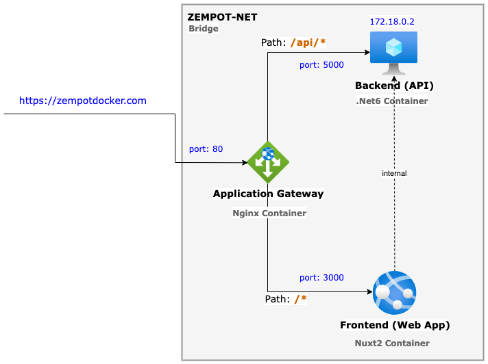
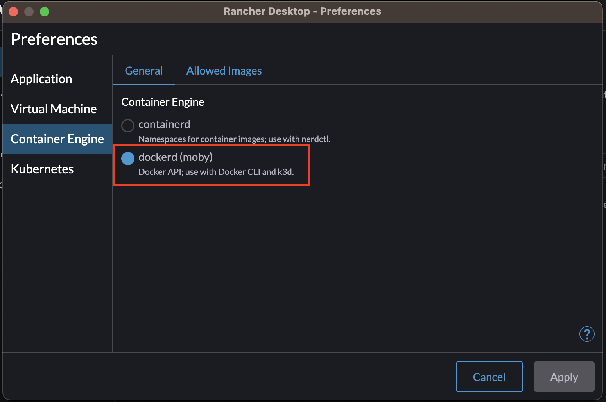
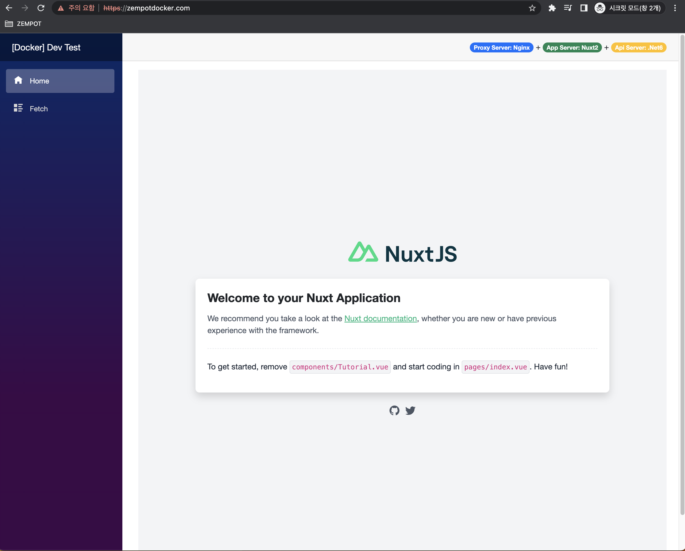

# Docker Dev Stack
> 도커를 활용해 기술 스펙 환경을 패키징 해서 로컬 환경에서 테스트 확인…
>
> SPA + API 조합 시 프론트 서버와 백엔드 서버가 분리 되어 있는 구조 이기에 서로 연동된 목업 구현이나 테스트 확인 필요 시 DevOps 를 통해 각자 배포 후 확인 해야 하는 프로세스 플로우를 간소화 할 수 있다.

## Docker 개발 환경 구성
- 프록시 서버: Nginx
- 프론트 서버: Nuxt2
- API 서버: .Net6

## 시스템 구성도


### [TODO] Docker + Docker Compose
- [v] Docker 환경 구성 셋팅
- [v] 네트워크 구성 셋팅
  - [v] 고정 IP 할당 셋팅
- [v] 볼륨 구성 셋팅
- [v] 쉘 스크립트 구성 셋팅
  - [v] Windows 환경
  - [v] Linux 환경
- [v] Docker Compose 환경 구성 셋팅
  - [v] 네트워크 연동
  - [v] 볼륨 마운트 연동
  - [v] 환경 변수 연동
- [v] [Nginx] 프록시 서버 환경 구성 셋팅
  - [v] 포트 포워딩 셋팅
  - [v] SSL 인증서 셋팅
  - [v] 인증서 자동 갱신 셋팅
- [v] [Nuxt2] 프론트 서버 환경 구성 셋팅
  - [v] Hot Reload 셋팅
  - [v] 기본 테스트 구조 환경 셋팅
  - [v] .Net 기본 템플릿 view (html, css, js) 적용
- [v] [.Net6] API 서버 환경 구성 셋팅
  - [-] Hot Reload 셋팅
  - [-] 기본 테스트 구조 환경 셋팅

> 프론트, 백엔드 분리되어 있는 디펙토리에서 작업하고 저장소 레파지토리를 서로 공유한 방식의 도커를 활용할 수도 있지만, `페어 프로그래밍` 기능을 사용하면 서로 분업화된 공유 방식이 아닌 동시 협업이 가능하게 활용 할 수 있다.


### 페어 프로그래밍 (동시 편집)
- [Visual Studio Live Share: 실시간 코드 공동 작업 도구](https://visualstudio.microsoft.com/ko/services/live-share/)

| IDE                | Session Link Share                  | OS 호환 |
|--------------------|-------------------------------------|-------|
| Intellij           | Intellij or 클라이언트 앱 다운로드/설치 후 접속 가능 | O     |
| Visual Studio Code | VSC or 웹 선택 접속 가능                   | O     |
| Visual Studio      | VS or VSC or 웹 선택 접속 가능             | O     |

- Session Link Share 모드 선택하면 이 후에도 자동으로 계속 해당 모드로 접속하게 되는데 초기화 하려면 브라우저 캐시 삭제 후 다시 접속하면 모드 선택 가능

---

### Setting Guide

**스캐폴딩 구조**
``` text
|- [backend] # .Net6
|- [frontend] # Nuxt2
|- [proxy] # Nginx
|- [scripts] # 쉘 스크립트
```

- Rancher Desktop 오픈소스 앱 다운로드:
  - <https://rancherdesktop.io/>

> 윈도우 OS 경우 사전에 WSL2 환경 구성 설치가 되어 있어야 한다.

Rancher Desktop 설치 후 설정 패널에서 `Cotainer Engine` > `dockerd (moby)` 로 적용해줘야 Docker 기본 커맨드 라인 API 를 사용 할 수 있음.



### Use Guide
1. Rancher Desktop 앱 실행
2. host 파일 설정

``` text
127.0.0.1 zempotdocker.com
```

3. 쉘 스크립트 실행
- 윈도우 OS
  - 도커 시작: [scripts] > [windows] > start_server.bat 실행
  - 도커 종료: [scripts] > [windows] > end_server.bat 실행
  - 백엔드 리빌드: [scripts] > [windows] > backend_rebuild.bat 실행
- 리눅스 OS
  - 도커 시작: [scripts] > [linux] > start_server.sh 실행
  - 도커 종료: [scripts] > [linux] > end_server.sh 실행
  - 백엔드 리빌드: [scripts] > [linux] > backend_rebuild.sh 실행

4. 웹 브라우저 접속
 


